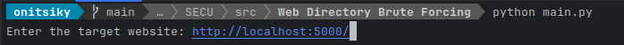
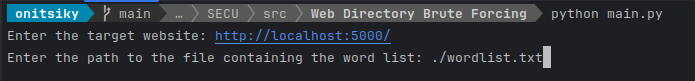

# Brute force check for existing website paths

## Description :scroll:
In this repository, you will find a _python_ script, which will, using
brute force manner, check for available paths on a given website.

## How to use :hammer_and_wrench:
The following steps will show you how to run this script.

### 1 - Get the project locally :computer:
You can clone directly or make a fork of this repository then clone it locally by running:
```shell
    git clone https://github.com/Onitsiky/website-brute-forcing.git
```

### 2 - Install required dependencies :wrench:
To do so, you must first install python on your machine. If it's not installed yet, you can download it 
[here](https://www.python.org/downloads/).

Once it's done, run the following to install the dependencies:
```shell
    cd <source_code_folder_name>
    pip install -r requirement.txt
```

### 3 - Run the application :rocket"
When you are done with installing dependencies, you can now run the application:

```shell
    python main.py
```

And few questions will be asked to you.
> - #### The website url
>   
>   Here as example the targeted url is: http://localhost:5000/
>   
>  __Make sure to end your website url with a "/"__ 

> - #### The wordlist
>   
>   Reference here the file containing the word list

> - #### How to you want to run the program, using mono thread or multiple threads ?
>   
>   Possible values are: __'y'__ if _yes_ and __'n'__ if _no_

> - #### Running program in monothread
>   If you decide to run the program in monothread, you just have to wait for the process to finish.

> - #### Running program in multithread
>   If you decide to use multithreading, you'll be asked the number of word to be checked by each thread
>   
>   Here for example we said 200, which means that each thread will treat 200 words, and the number of threads
>   will be: _total number of words / 200_
>   
>   So for 1000 words, there will be 5 threads
> 
>   And once it's done, wait until the program finishes

### 4 - Output :sparkles:
Once the program finishes to run, a list of available path will be displayed with the received status_code,
and also the execution time


## Author :boy:
This project was done by: __RANAIVOSON Onitsiky__, __STD21028__

Email: __hei.onitsiky@gmail.com__

Thanks !